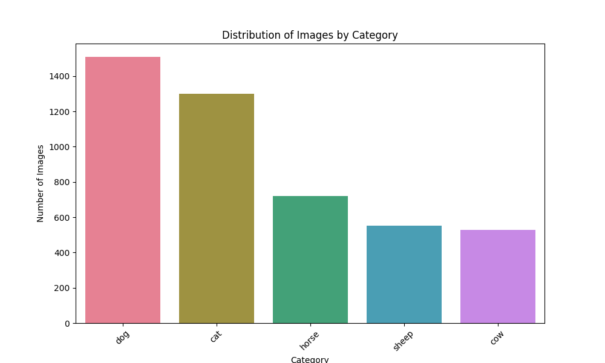
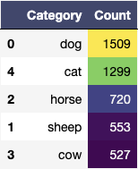
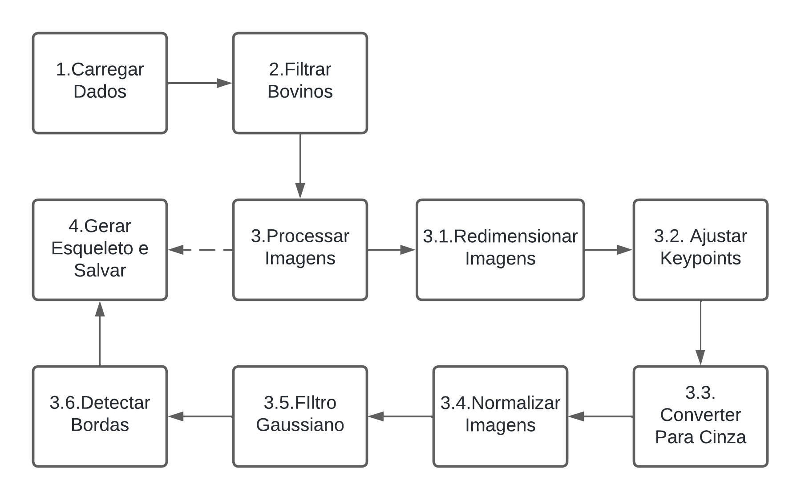
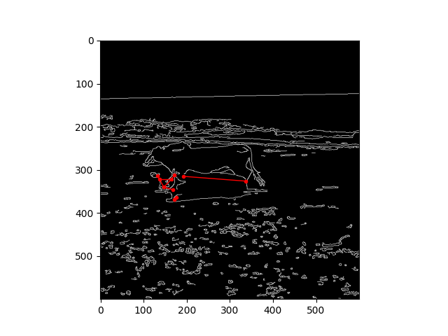
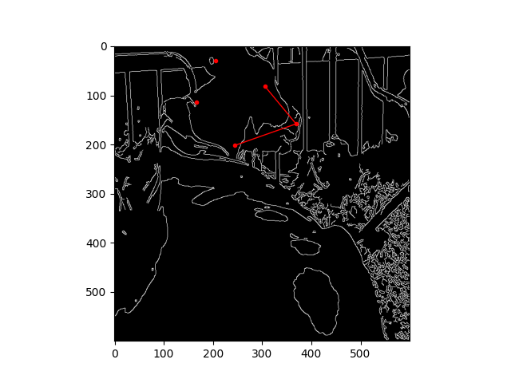
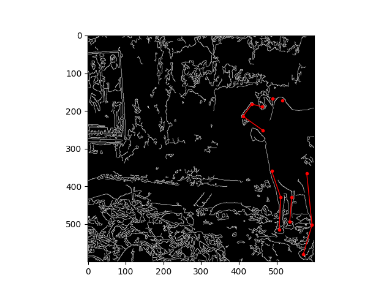
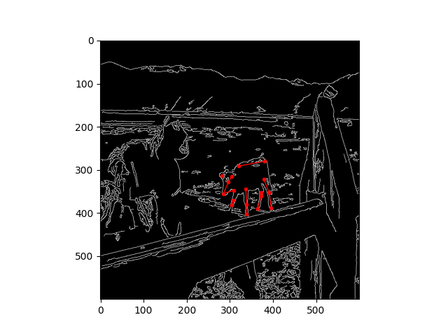
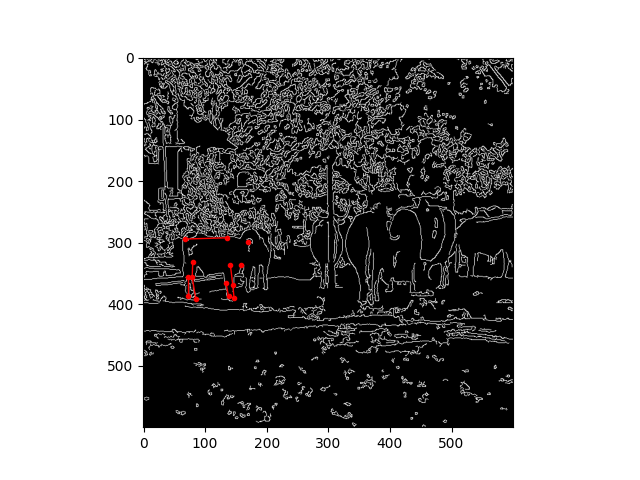

# Pose Estimation para Bovinos


## Passo a Passo para Rodar o Projeto

### Clonar o Repositório

Clone o repositório do GitHub para a sua máquina local.

```sh
git clone https://github.com/username/repo.git
cd repo
```

### Instalar Dependências

Instale as dependências necessárias listadas no arquivo `requirements.txt`.

```sh
pip install -r requirements.txt
```

### Estrutura de Diretórios

Certifique-se de que a estrutura de diretórios esteja conforme descrito acima, com as imagens e o arquivo `keypoints.js` na pasta `data`.

### Executar o Script Principal

Execute o script principal `main.py` para realizar a análise exploratória, filtragem, processamento e visualização dos resultados.

```sh
python main.py
```

### Verificar Resultados

Os resultados das análises e do processamento serão exibidos na saída do console e os gráficos gerados estarão disponíveis na pasta `results`.

### Estrutura do Repositório

```plaintext
data
    ├── images
    │   ├── 0001.jpg
    │   ├── 0002.jpg
    │   └── ...
    └── keypoints.js
results
    ├── processed
    │   ├── cow_0.jpg
    │   ├── cow_1.jpg
    │   └── ...
    ├── graphic_0.png
    └── table_0.png
src
    ├── data_loading.py
    ├── exploratory_analysis.py
    ├── results.py
    ├── utils.py
    └── visualization.py
.gitignore
main.py
requirements.txt
README.md
```

*O dataset com as imagens pode ser baixado através desse [link](https://drive.google.com/drive/folders/1xxm6ZjfsDSmv6C9JvbgiGrmHktrUjV5x) pois ele não está presente no repositório


## 1. Análise Exploratória

Realizamos uma análise exploratória dos dados para compreender a distribuição das categorias. O gráfico de barras apresenta a quantidade de imagens por tipo de animal no conjunto de dados. Cada barra, representada por uma cor distinta, corresponde a um tipo de animal, facilitando a comparação da quantidade de imagens entre os diferentes tipos.

**Distribuição das Categorias:**



**Tabela de Categorias:**

<p align="center">
  
</p>


Observamos que a categoria de bovinos possui 527 imagens após um pré-processamento de eliminação de duplicatas. A distribuição das categorias é mostrada no gráfico acima.


## 2. Filtragem e Processamento de Imagens

Filtramos o dataset para obter apenas as imagens de bovinos e realizamos o processamento para detectar e visualizar os keypoints.

**Etapas de Processamento:**

1. Carregar os dados de anotações JSON e imagens do Dataset.
2. Filtrar as imagens através das anotações para bovinos e plotar gráficos e tabelas.
3. Processar as imagens para visualizar os keypoints.
    - 3.1. Redimensionamento da imagem para as novas dimensões especificadas (por exemplo, 150x150).
    - 3.2. Ajustar os keypoints proporcionalmente ao novo tamanho da imagem.
    - 3.3. Converter a imagem redimensionada para escala de cinza para simplificar o processamento.
    - 3.4. Normalizar a imagem de escala de cinza para valores no intervalo [0, 1] para melhorar a estabilidade do processamento.
    - 3.5. Aplicar um filtro gaussiano à imagem normalizada para suavizar a imagem e reduzir o ruído.
    - 3.6. Detectar bordas na imagem suavizada usando o algoritmo de detecção de bordas de Canny, convertendo a imagem suavizada de volta para o intervalo [0, 255] antes da detecção.
4. Geração dos pontos dos esqueletos bovinos e salvamento das imagens geradas

Essas etapas garantem que a imagem esteja preparada adequadamente para a visualização dos keypoints e para a análise subsequente.

**Figura Ilustrativa do Processo:**



## 3. Resultados Finais

**Exemplo de imagens geradas:**

A seguir é apresentado algumas das imagens já processadas lado a lado.

<p align="center">
    <p align="center">
        
        
        
    </p>
  
<p align="center">
    
    
</p>
</p>


Podemos observar que tivemos um reusltado muito interessante dos esqueletos destacando ainda mais a siluetas extraidas através da detecao de bordas. Padronizamos as imagens em tamanho, cor e textura, permitindo maior capacidade comparativa entre os resultados obtidos.

## 4. Conclusões

Nessa atividade, foi possível entender a importância das técnicas de processamento de imagem, que destacam características importantes como bordas e contornos, facilitando análises futuras. Quanto às limitações do trabalho, o número reduzido de categorias de animais simplificou a tarefa, tornando-a menos complexa. Um desafio maior para o futuro seria lidar com mais dados e dados mais complexos. Sugiro que, em trabalhos futuros, utilizemos a visão computacional em tarefas para carros autônomos, aplicando os conceitos aprendidos em projetos mais avançados.

### Principais Aprendizados

- A importância das técnicas de processamento de imagem, que destacam características importantes, como bordas e contornos.
- A relevância dos keypoints na estimativa de poses.
- Os desafios no processamento e visualização dos dados.

### Limitações do Trabalho

- O número reduzido de categorias de animais simplificou a tarefa.
- A qualidade das anotações e das imagens pode variar.

### Sugestões para Trabalhos Futuros

- Uso de técnicas de deep learning para melhorar a precisão.
- Expansão do dataset com mais imagens e categorias.
- Aplicação da visão computacional em tarefas para carros autônomos, utilizando os conceitos aprendidos em projetos mais complexos.

